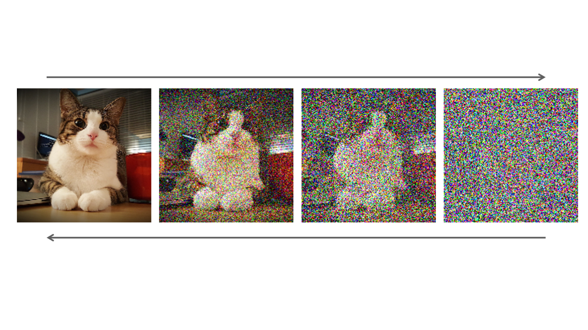

# Generative AI
Generative AI encompasses AI techniques that create new data instances resembling existing datasets. These models, like GANs and VAEs, learn patterns from large datasets and generate new samples. They're used in image synthesis, text generation, and music composition. Generative AI enables AI systems to produce novel and realistic content, advancing fields like computer vision and natural language processing, and fostering creativity across various domains.
## Machine Learning Basics

Machine learning is a branch of artificial intelligence (AI) that focuses on building systems that can learn from data. It involves the development of algorithms and models that enable computers to automatically learn and improve from experience without being explicitly programmed.

## Neural Networks

Neural networks are a class of algorithms inspired by the structure and functioning of the human brain. They consist of interconnected nodes (neurons) organized into layers. Neural networks are capable of learning complex patterns in data and are widely used in various machine learning tasks, including classification, regression, and clustering.

# Convolutional Neural Networks (CNNs) for Image Processing

Convolutional Neural Networks (CNNs) are a class of deep learning models particularly effective for image processing tasks. They automatically learn hierarchical representations of images through the use of convolutional layers, pooling layers, and fully connected layers. Here's a detailed explanation of how CNNs work for image processing:

## Convolutional Layers

In a CNN, convolutional layers apply convolution operations to the input image. A convolution operation involves sliding a small filter (also known as a kernel) across the input image to extract features. Each filter learns to detect specific patterns or features such as edges, textures, or shapes.

### Feature Maps

The output of a convolutional layer is called a feature map. Each feature map represents the presence of a particular feature or pattern in the input image.

## Pooling Layers

Pooling layers reduce the spatial dimensions of the feature maps while retaining the most important information. The most common pooling operation is max pooling, which extracts the maximum value from each local region of the feature map. This helps in downsampling the feature maps, making the network more robust to variations in input images and reducing computational complexity.

## Fully Connected Layers

The output of the last convolutional or pooling layer is flattened into a one-dimensional vector, which serves as the input to the fully connected layers. Fully connected layers perform classification based on the features extracted by the earlier layers. They learn to map the features to the output classes or categories.

## Training

CNNs are trained using backpropagation and gradient descent. During training, the model learns to adjust the parameters (weights and biases) of the convolutional filters and fully connected layers to minimize the difference between the predicted output and the ground truth labels. Data augmentation techniques are often used to prevent overfitting and improve generalization.

# Diffusion Models for Image Processing

Diffusion Models, though primarily developed for natural language processing (NLP), can also be adapted for image processing tasks. In the context of image processing, diffusion models are used for tasks such as image generation, denoising, and inpainting. Here's an overview of how diffusion models work for image processing:

## Image Generation

Similar to text generation, diffusion models generate images by iteratively denoising noise-corrupted versions of the image. Each diffusion step refines the image to reduce the noise and generate a visually coherent output.

### Probabilistic Model

Diffusion models treat image generation as a probabilistic process, where the model estimates the conditional probability distribution of the image pixels given the noise level and the previous pixels in the sequence.

## Image Denoising

Given a noisy input image, diffusion models iteratively remove the noise by leveraging the surrounding pixel information. This iterative process gradually improves the quality of the image by reducing the noise level. Unlike traditional denoising methods, diffusion models learn the denoising process from data, making them more adaptable to different types of noise and image content.

## Image Inpainting

Diffusion models can also be used for image inpainting, where missing or damaged regions of an image are filled in based on the surrounding context. By conditioning on the observed pixels and the known regions of the image, diffusion models predict the missing pixel values in a way that is consistent with the surrounding context.

## Training

Diffusion models are trained using maximum likelihood estimation (MLE), where the model is optimized to maximize the likelihood of generating the ground truth images from their noise-corrupted versions. Model parameters are updated using gradient descent or similar optimization algorithms to minimize the reconstruction error between the generated images and the ground truth images.

### Example of Diffusion Model

## Getting Started

To get started with the code implementations and resources in this repository, please refer to the respective directories for each topic.

